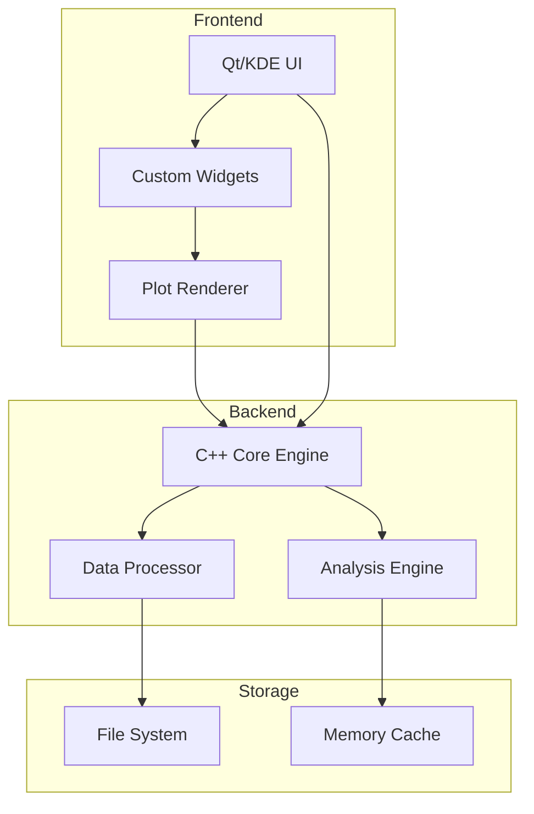
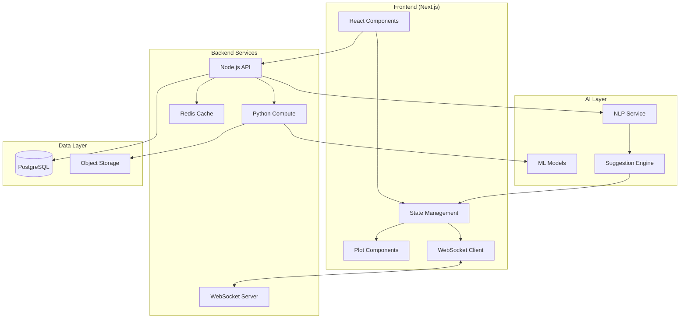
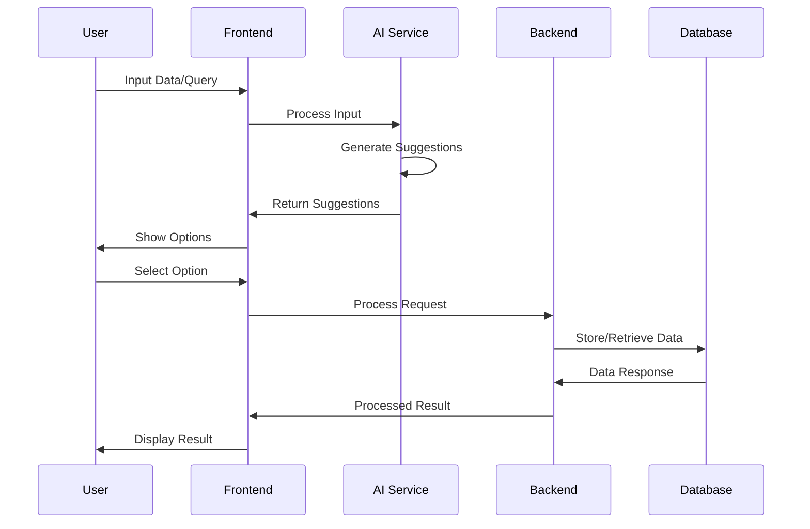
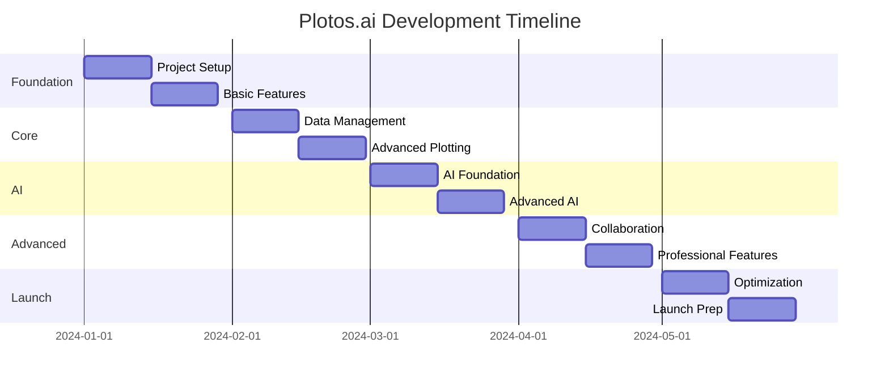

# LabPlot Analysis & Plotos.ai Planning

## Introduction

This document presents an analysis of LabPlot, an open-source data visualization and analysis tool, and outlines the planning for Plotos.ai, a next-generation web-based plotting application enhanced with AI capabilities.

LabPlot is a feature-rich, cross-platform application designed for interactive graphing and analysis of scientific data. It offers a wide range of plotting options, data manipulation tools, and statistical analysis features, catering primarily to researchers, scientists, and data enthusiasts working with desktop environments.

Plotos.ai, our proposed application, aims to build upon the strengths of LabPlot while addressing modern data science needs. It is envisioned as a web-based platform that combines advanced plotting capabilities with artificial intelligence to streamline the data visualization and analysis process.

Key similarities between LabPlot and Plotos.ai include:
1. Focus on scientific data visualization
2. Support for various data formats and sources
3. Emphasis on user interactivity and customization
4. Provision of statistical analysis tools

The primary purposes of Plotos.ai are to:
1. Democratize access to advanced data visualization tools
2. Leverage AI to assist users in data interpretation and plot selection
3. Facilitate collaboration through cloud-based sharing and real-time editing
4. Provide a seamless, browser-based experience for data scientists and researchers

Our goals for the Plotos.ai project include:
1. Developing a highly performant, scalable web application using modern technologies
2. Implementing AI-driven features for plot suggestions, data insights, and workflow optimization
3. Creating an intuitive, user-friendly interface that caters to both novices and experts
4. Building a robust ecosystem that supports plugins and integrations with other data science tools
5. Establishing a strong community around the platform to drive continuous improvement and innovation

This analysis and planning document will guide the development of Plotos.ai, ensuring that we create a cutting-edge data visualization platform that meets the evolving needs of the scientific and data science communities.


## LabPlot Analysis

### Project Structure

- `/src`
  - `/frontend`: UI components and user interaction
  - `/backend`: Core processing and computation
  - `/plugins`: Extensible functionality modules
  - `/3rdparty`: External dependencies
  - `/tools`: Utility functions and helpers
- `/data`: Sample datasets and resources
- `/tests`: Testing infrastructure
- `/doc`: Documentation
- `/lib`: Core libraries

### Features Overview

1. Data Visualization & Plotting
2. Interactive Data Analysis
3. Statistical Computing
4. Live Data Support
5. Multi-format Import/Export
6. Interactive Notebooks
7. Cross-platform Compatibility

### Detailed Features

#### Data Visualization

- 2D/3D Plotting
- Custom Plot Styling
- Real-time Plot Updates
- Multiple Plot Types (scatter, line, bar, etc.)
- Advanced Chart Customization

#### Data Analysis

- Statistical Functions
- Curve Fitting
- FFT Analysis
- Data Filtering
- Signal Processing

#### Data Management

- Multiple Format Support
- Live Data Integration
- Data Transformation Tools
- Dataset Management

### Technology Stack

#### Backend

- C++ Core Engine
- KDE Framework
- Qt Libraries
- Scientific Computing Libraries

#### Frontend

- Qt Widgets
- KDE UI Components
- Custom Rendering Engine

#### Data Flow

1. Data Input →
2. Processing Pipeline →
3. Analysis Engine →
4. Visualization Layer →
5. User Interface

### Advantages

- Professional-grade Plotting
- Native Performance
- Rich Feature Set
- Open Source
- Cross-platform
- Active Community

### Weakness Points

- Desktop-only
- Complex Setup
- Learning Curve
- Limited Web Integration
- Resource Intensive

### Architecture Diagrams

#### LabPlot Current Architecture




### LabPlot Structure

- `/src`: Main source code directory
  - `/backend`: Core processing and computation logic
  - `/commonfrontend`: Shared frontend components
  - `/kdefrontend`: KDE-specific UI components
  - `/plugins`: Extensible functionality modules
  - `/tools`: Utility functions and helpers
- `/tests`: Unit and integration tests
- `/doc`: Documentation files
- `/icons`: Application and UI icons
- `/data`: Sample datasets and resources
  - `/color-schemes`: Color palettes for plots
  - `/colorchooser`: Color selection tools
  - `/datasets`: Example datasets for testing and demos
  - `/examples`: Sample project files and templates
  - `/pics`: Images used in the application
- `/cmake`: CMake modules and build scripts
- `/scripts`: Utility scripts for development and deployment
- `/3rdparty`: Third-party libraries and dependencies
- `/po`: Internationalization files


---

## Plotos.ai Planning

### Alternative Libraries

#### Plotting Libraries

1. **Plotly.js**
   - Professional-grade
   - Interactive
   - TypeScript Support
   - Large Community

2. **D3.js**
   - Highly Customizable
   - SVG-based
   - Data-driven
   - Rich Ecosystem

3. **Chart.js**
   - Lightweight
   - Easy Integration
   - Good Performance
   - Mobile-friendly

4. **Apache ECharts**
   - Enterprise Features
   - Large Dataset Handling
   - Multiple Chart Types
   - Good Documentation

### Benefits Over LabPlot

1. Web Accessibility
   - No Installation Required
   - Cross-device Access
   - Easy Sharing
   - Collaborative Features

2. Modern Development
   - Rapid Updates
   - Modern UI/UX
   - Easy Integration
   - Cloud Features

3. AI Integration
   - Real-time Analysis
   - Smart Suggestions
   - Automated Insights
   - Natural Language Interface

### Weakness Points

- Browser Limitations
- Network Dependency
- Complex Computation Overhead
- Memory Constraints
- Limited Offline Support

### Frontend Overview

#### Architecture

- Next.js/React
- TypeScript
- State Management (Redux/Zustand)
- Component Library (MUI/Tailwind)

#### Key Components

1. Plot Editor
2. Data Manager
3. Analysis Tools
4. Settings Panel
5. Collaboration Tools

### Backend Overview

#### Core Services

- Node.js/TypeScript API
- Python Computing Engine
- WebSocket Server
- File Management

#### Data Services

- Database (PostgreSQL)
- Cache Layer (Redis)
- Object Storage
- Query Optimization

### AI Services Overview

#### Features

1. **Smart Plot Suggestions**
   - Data Type Analysis
   - Context Understanding
   - Style Recommendations

2. **Natural Language Interface**
   - Plot Generation
   - Data Analysis
   - Query Processing

3. **Automated Insights**
   - Pattern Detection
   - Anomaly Detection
   - Trend Analysis

4. **Optimization**
   - Performance Tuning
   - Resource Management
   - Auto-scaling

#### Integration Points

- OpenAI API
- TensorFlow.js
- Hugging Face
- Custom ML Models

#### Data Flow

1. User Input →
2. AI Processing →
3. Suggestion Generation →
4. User Feedback →
5. Continuous Learning

### Architecture Diagrams

#### Plotos.ai Architecture



#### Data Flow in Plotos.ai



## Next.js Analysis for Plotos.ai

### Why Next.js is Ideal

#### 1. Performance Benefits
- **Server-Side Rendering (SSR)**
  * Critical for initial plot rendering
  * Better SEO for shared plots
  * Faster Time to First Contentful Paint (FCP)

- **Static Site Generation (SSG)**
  * Pre-render static content
  * Documentation pages
  * Example galleries

- **Incremental Static Regeneration**
  * Dynamic plot updates
  * Cached plot previews
  * Real-time collaboration

#### 2. Development Experience
- **File-based Routing**
  * Intuitive project structure
  * Easy API routes creation
  * Dynamic plot URLs

- **TypeScript Integration**
  * First-class TypeScript support
  * Built-in type checking
  * Better code reliability

- **API Routes**
  * Built-in backend API
  * WebSocket support
  * Serverless functions

#### 3. Data Visualization Benefits
- **Optimized Data Loading**
  * Streaming large datasets
  * Progressive loading
  * Automatic code splitting

- **Canvas/WebGL Support**
  * Hardware acceleration
  * Complex visualizations
  * Smooth animations

#### 4. AI Integration
- **Edge Functions**
  * ML model inference
  * Real-time processing
  * Distributed computing

- **API Integration**
  * OpenAI/HuggingFace
  * Vector databases
  * Streaming responses

#### Data Flow

1. User Input →
2. AI Processing →
3. Suggestion Generation →
4. User Feedback →
5. Continuous Learning

### Alternative Considerations

#### Pure React (Create React App)
❌ Lacks SSR/SSG capabilities
❌ Manual routing setup
❌ No built-in API routes
❌ More complex deployment

#### Remix
✅ Good SSR support
❌ Smaller ecosystem
❌ Less flexible data loading
❌ Limited static generation

#### Gatsby
✅ Great static generation
❌ Less suitable for dynamic data
❌ Steeper learning curve
❌ GraphQL complexity

### Next.js Advantages for Plotos.ai

1. **Architecture Benefits**
   - Hybrid rendering strategies
   - Edge computing capabilities
   - Built-in performance optimizations
   - Middleware support

2. **Development Speed**
   - Zero configuration
   - Fast refresh
   - Built-in optimizations
   - Excellent DX

3. **Scalability**
   - Vercel deployment
   - Edge network
   - Automatic scaling
   - Global distribution

4. **Enterprise Features**
   - Image optimization
   - International routing
   - Analytics
   - Security headers

### Implementation Strategy with Next.js

1. **Project Directory Structure**
```
plotos-ai/
├── frontend/
│   ├── app/
│   │   ├── (auth)/
│   │   │   ├── login/
│   │   │   └── register/
│   │   ├── (dashboard)/
│   │   │   ├── plots/
│   │   │   ├── data/
│   │   │   ├── notebook/
│   │   │   │   ├── editor/
│   │   │   │   ├── kernel/
│   │   │   │   └── outputs/
│   │   │   ├── scripts/
│   │   │   │   ├── editor/
│   │   │   │   ├── runner/
│   │   │   │   └── results/
│   │   │   ├── worksheet/
│   │   │   └── settings/
│   │   └── components/
│   ├── plugins/
│   │   ├── widgets/
│   │   │   ├── NumberSpinBox/
│   │   │   └── UTCDateTime/
│   │   └── core/
│   ├── features/
│   │   ├── datapicker/
│   │   ├── spreadsheet/
│   │   └── matrix/
│   ├── integrations/
│   │   ├── docking/
│   │   ├── xlsx/
│   │   ├── origin/
│   │   └── mcap/
│   ├── lib/                     # Shared Libraries
│   │   ├── scientific/          # Scientific Computing
│   │   │   ├── transforms/
│   │   │   ├── statistics/
│   │   │   └── fitting/
│   │   ├── visualization/       # Visualization Utils
│   │   │   ├── colors/
│   │   │   ├── scales/
│   │   │   └── layouts/
│   │   └── utils/
│   ├── templates/
│   ├── themes/
│   ├── welcomescreen/
│   ├── public/
│   └── styles/
├── backend/
│   ├── api/
│   │   ├── plots/
│   │   ├── jupyter/
│   │   │   ├── kernels/
│   │   │   ├── sessions/
│   │   │   └── websocket/
│   │   ├── python/
│   │   │   ├── executor/
│   │   │   ├── packages/
│   │   │   └── environment/
│   │   ├── data/
│   │   └── ai/
│   ├── core/
│   │   ├── datasources/
│   │   ├── gsl/               # GNU Scientific Library Bridge
│   │   └── nsl/               # Numerical Library
│   ├── models/
│   │   ├── plots/
│   │   │   ├── axes/
│   │   │   ├── data/
│   │   │   └── config/
│   │   └── scientific/
│   ├── services/
│   │   ├── file-handlers/
│   │   │   ├── excel/
│   │   │   ├── origin/
│   │   │   └── mcap/
│   │   ├── computation/       # Scientific Computation
│   │   │   ├── transforms/
│   │   │   ├── statistics/
│   │   │   └── optimization/
│   │   ├── auth/
│   │   ├── plot/
│   │   └── data/
│   └── utils/
├── services/
│   ├── ai-service/
│   │   ├── plot-suggestion/
│   │   ├── data-analysis/
│   │   └── optimization/
│   ├── data-processing/
│   │   ├── transforms/
│   │   ├── filtering/
│   │   └── validation/
│   └── real-time/
├── platform/
│   ├── desktop/
│   │   └── touchbar/
│   └── mobile/
├── tools/
│   ├── scientific/           # Scientific Tools
│   └── visualization/        # Visualization Tools
├── docs/
│   ├── api/
│   └── guides/
├── config/
│   ├── development/
│   └── production/
└── scripts/
```

1. **Key Features Implementation**
- Server Components for data-heavy operations
- Client Components for interactive plots
- Streaming for large datasets
- Edge functions for AI processing

1. **Performance Optimizations**
- Route segments
- Parallel routes
- Intercepting routes
- Partial prerendering

### Recommendation

Next.js is strongly recommended for Plotos.ai because it provides:
1. Optimal performance for data-heavy applications
2. Built-in solutions for common challenges
3. Excellent developer experience
4. Enterprise-grade scalability
5. Future-proof architecture

The framework's features align perfectly with the requirements of a professional plotting application, especially one enhanced with AI capabilities. The web-first approach with TypeScript provides a more suitable foundation for a professional plotting application with AI capabilities.

## Development Roadmap

### Phase 1: Foundation (Weeks 1-4)

#### Week 1-2: Project Setup
1. **Development Environment**
   - Next.js 14 setup with TypeScript
   - ESLint and Prettier configuration
   - Git workflow setup
   - CI/CD pipeline (GitHub Actions)

2. **Core Architecture**
   - Project structure implementation
   - Base component library setup
   - State management configuration (Zustand)
   - API route structure

3. **Design System**
   - UI component library (Shadcn/UI)
   - Theme configuration
   - Responsive layout setup
   - Design tokens definition

#### Week 3-4: Basic Features
1. **Authentication System**
   - User authentication (Next-Auth)
   - Role-based access control
   - Profile management
   - Session handling

2. **Basic Plot Features**
   - Plot component integration (Plotly.js)
   - Basic chart types implementation
   - Plot customization options
   - Data input handling

### Phase 2: Core Functionality (Weeks 5-8)

#### Week 5-6: Data Management
1. **Data Import/Export**
   - File upload system
   - CSV/JSON parsing
   - Data validation
   - Export functionality

2. **Data Processing**
   - Data transformation pipeline
   - Statistical functions
   - Data cleaning utilities
   - Real-time updates

#### Week 7-8: Advanced Plotting
1. **Advanced Visualizations**
   - Complex chart types
   - Interactive features
   - Custom themes
   - Animation system

2. **Plot Management**
   - Plot saving/loading
   - Version control
   - Sharing capabilities
   - Template system

### Phase 3: AI Integration (Weeks 9-12)

#### Week 9-10: AI Foundation
1. **AI Infrastructure**
   - OpenAI API integration
   - Vector database setup
   - Model pipeline creation
   - Edge function implementation

2. **Basic AI Features**
   - Natural language plot generation
   - Basic plot suggestions
   - Data analysis helpers
   - Error detection

#### Week 11-12: Advanced AI
1. **Smart Features**
   - Advanced plot recommendations
   - Automated insights
   - Pattern detection
   - Anomaly detection

2. **AI Optimization**
   - Performance tuning
   - Model caching
   - Response optimization
   - Error handling

### Phase 4: Advanced Features (Weeks 13-16)

#### Week 13-14: Collaboration
1. **Real-time Features**
   - Collaborative editing
   - Live updates
   - Comments system
   - Change tracking

2. **Sharing System**
   - Public/private plots
   - Team management
   - Permission system
   - Embedding support

#### Week 15-16: Professional Features
1. **Advanced Analysis**
   - Custom calculations
   - Formula editor
   - Advanced statistics
   - Data fitting

2. **Export Options**
   - High-resolution export
   - Multiple formats
   - Custom styling
   - Batch processing

### Phase 5: Polish & Launch (Weeks 17-20)

#### Week 17-18: Optimization
1. **Performance**
   - Load time optimization
   - Memory management
   - Caching strategy
   - Bundle optimization

2. **User Experience**
   - UX improvements
   - Accessibility
   - Mobile optimization
   - Error handling

#### Week 19-20: Launch Preparation
1. **Documentation**
   - User documentation
   - API documentation
   - Tutorial system
   - Example gallery

2. **Launch**
   - Beta testing
   - Bug fixes
   - Performance monitoring
   - Analytics setup

### Post-Launch Phase

#### Continuous Improvement
1. **Feature Enhancement**
   - User feedback integration
   - New plot types
   - Advanced AI features
   - Integration options

2. **Platform Growth**
   - Community features
   - Plugin system
   - API ecosystem
   - Enterprise features

#### Monitoring & Maintenance
1. **System Health**
   - Performance monitoring
   - Error tracking
   - Security updates
   - Scalability optimization

2. **User Success**
   - Support system
   - Usage analytics
   - Feature adoption
   - Customer feedback

### Key Milestones



### Risk Management

1. **Technical Risks**
   - Data processing performance
   - AI response latency
   - Real-time collaboration scaling
   - Browser limitations

2. **Mitigation Strategies**
   - Progressive enhancement
   - Fallback options
   - Performance monitoring
   - Load testing

3. **Contingency Plans**
   - Feature prioritization
   - Scalability options
   - Alternative technologies
   - Resource allocation

## Implementation Details

### 1. Development Environment Setup

1. **Base Project Setup**
```bash
npx create-next-app@latest plotos-ai --typescript --tailwind --eslint
cd plotos-ai
```

2. **Essential Dependencies**
```bash
# Core Dependencies
npm install d3 chart.js plotly.js react-query zustand

# UI Components
npm install @shadcn/ui @radix-ui/react-* tailwindcss

# Scientific Computing
npm install mathjs numeric.js gsl

# Development Tools
npm install -D jest @testing-library/react cypress
```

### 2. Core Features Implementation

1. **Plot Engine Integration**
```typescript
// src/lib/plot-engine/index.ts
import { PlotEngine } from './types';
import { D3Renderer, ChartJSRenderer, PlotlyRenderer } from './renderers';

export class PlotEngineManager {
    private renderers = new Map<string, PlotRenderer>();

    constructor() {
        this.renderers.set('d3', new D3Renderer());
        this.renderers.set('chartjs', new ChartJSRenderer());
        this.renderers.set('plotly', new PlotlyRenderer());
    }

    selectRenderer(type: string): PlotRenderer {
        return this.renderers.get(type) || this.renderers.get('d3');
    }
}
```

2. **Scientific Computing Setup**
```typescript
// src/lib/scientific/index.ts
import { createScientificContext } from './context';
import { setupComputationEngine } from './engine';

export function initializeScientificComputing() {
    const context = createScientificContext();
    const engine = setupComputationEngine(context);
    return { context, engine };
}
```

3. **AI Integration**
```typescript
// src/services/ai/index.ts
import { AIService } from './types';
import { setupLLM } from './llm';

export class AIServiceManager {
    private llm = setupLLM();

    async processQuery(query: string, context: any) {
        const response = await this.llm.process(query, context);
        return this.formatResponse(response);
    }
}
```

### 3. Component Architecture

1. **Plot Components**
```typescript
// src/components/plots/ScientificPlot.tsx
import { usePlotEngine } from '@/hooks/usePlotEngine';
import { usePlotData } from '@/hooks/usePlotData';

export function ScientificPlot({ config, data }) {
    const engine = usePlotEngine(config.renderer);
    const processedData = usePlotData(data);

    return (
        <div className="scientific-plot">
            {engine.render(processedData)}
        </div>
    );
}
```

2. **AI Assistant Components**
```typescript
// src/components/assistant/ChatInterface.tsx
import { useAI } from '@/hooks/useAI';
import { usePlotContext } from '@/hooks/usePlotContext';

export function ChatInterface() {
    const ai = useAI();
    const plotContext = usePlotContext();

    return (
        <div className="chat-interface">
            <MessageList />
            <SuggestionPanel />
            <InputArea />
        </div>
    );
}
```

### 4. State Management

```typescript
// src/store/plotStore.ts
import create from 'zustand';

interface PlotState {
    plots: Map<string, Plot>;
    activePlot: string | null;
    addPlot: (plot: Plot) => void;
    updatePlot: (id: string, updates: Partial<Plot>) => void;
}

export const usePlotStore = create<PlotState>((set) => ({
    plots: new Map(),
    activePlot: null,
    addPlot: (plot) => 
        set((state) => ({
            plots: new Map(state.plots).set(plot.id, plot)
        })),
    updatePlot: (id, updates) =>
        set((state) => {
            const plots = new Map(state.plots);
            const plot = plots.get(id);
            if (plot) {
                plots.set(id, { ...plot, ...updates });
            }
            return { plots };
        })
}));
```

## Plotos.ai Project Implementation

To create the Plotos.ai project, follow these steps:

### 1. Project Setup

1. **Create Project and Install Dependencies**
```bash
# Initialize Next.js project with TypeScript
npx create-next-app@latest plotos-ai --typescript
cd plotos-ai

# Install dependencies
npm install d3 chart.js plotly.js @tanstack/react-query zustand
npm install @shadcn/ui tailwindcss postcss autoprefixer
```

2. **Configure Project**
```typescript
// next.config.js
module.exports = {
  experimental: {
    serverActions: true,
  },
  // ... other configurations
};
```

3. **Development Workflow**
```bash
# Start development
npm run dev

# Run tests
npm test

# Build for production
npm run build
```

### 2. Development Process

1. **Start Development**
```bash
# Run development server
npm run dev

# Open http://localhost:3000
```

2. **Testing**
```bash
# Run unit tests
npm test

# Run E2E tests
npm run cypress
```

3. **Build and Deploy**
```bash
# Build for production
npm run build

# Start production server
npm start
```

### 3. Key Implementation Areas

1. **Scientific Plotting**
   - Implement plot engine with multiple renderers
   - Create scientific axis system
   - Add data processing pipeline

2. **Data Processing**
   - Set up scientific computing engine
   - Create data transformation pipeline
   - Implement real-time processing

3. **AI Assistant**
   - Integrate LLM service
   - Build chat interface
   - Implement context-aware suggestions

4. **User Interface**
   - Build responsive layout
   - Create interactive components
   - Implement accessibility features

### 4. Quality Assurance

1. **Testing Strategy**
   - Unit tests for core functionality
   - Integration tests for features
   - E2E tests for user flows
   - Performance testing

2. **Code Quality**
   - ESLint configuration
   - Prettier setup
   - TypeScript strict mode
   - Code review process

3. **Monitoring**
   - Error tracking
   - Performance metrics
   - Usage analytics

### 5. Deployment Pipeline

1. **CI/CD Setup**
   - GitHub Actions configuration
   - Automated testing
   - Deployment automation

2. **Environment Configuration**
   - Development settings
   - Staging environment
   - Production deployment

This implementation plan provides a structured approach to building Plotos.ai, ensuring both technical excellence and user satisfaction.

## Additional Key Features from LabPlot

### Advanced Scientific Features

1. **Matrix Operations**
   - Matrix Algebra Support
   - Matrix Transformations
   - Element-wise Operations
   - Matrix Visualization Tools

2. **Advanced Curve Fitting**
   - Multiple Fit Models
   - Custom Fit Functions
   - Error Analysis
   - Residual Plots
   - Confidence Intervals

3. **Signal Processing**
   - FFT Analysis
   - Digital Filters
   - Window Functions
   - Spectral Analysis
   - Time-Series Processing

4. **Statistical Analysis**
   - Descriptive Statistics
   - Hypothesis Testing
   - Distribution Fitting
   - Regression Analysis
   - ANOVA

### Enhanced Data Handling

1. **Live Data Integration**
   ```typescript
   // services/data/live/LiveDataManager.ts
   export class LiveDataManager {
       async connectToDataSource(source: DataSourceConfig): Promise<LiveDataStream> {
           const stream = await this.createStream(source);
           await this.setupMonitoring(stream);
           return stream;
       }

       private async processLiveData(data: LiveData): Promise<void> {
           await this.validate(data);
           await this.transform(data);
           await this.broadcast(data);
       }
   }
   ```

2. **Advanced Import/Export**
   ```typescript
   // services/data/io/DataIO.ts
   export class DataIO {
       async importData(source: DataSource): Promise<Dataset> {
           const importer = this.getImporter(source.type);
           const data = await importer.read(source);
           return this.processImportedData(data);
       }

       async exportData(data: Dataset, format: ExportFormat): Promise<ExportResult> {
           const exporter = this.getExporter(format);
           return await exporter.write(data);
       }
   }
   ```

### Scientific Computing Integration

1. **GSL Integration**
   ```typescript
   // services/scientific/GSLBridge.ts
   export class GSLBridge {
       async performLinearAlgebra(matrix: Matrix): Promise<Result> {
           return await this.gslWorker.compute('linearAlgebra', matrix);
       }

       async solveODE(system: ODESystem): Promise<Solution> {
           return await this.gslWorker.compute('odeSystem', system);
       }
   }
   ```

2. **Numerical Methods**
   ```typescript
   // services/scientific/NumericalMethods.ts
   export class NumericalMethods {
       async integrate(func: Function, bounds: Bounds): Promise<number> {
           const integrator = new AdaptiveIntegrator(func);
           return await integrator.compute(bounds);
       }

       async findRoots(equation: Equation): Promise<number[]> {
           const solver = new RootFinder(equation);
           return await solver.findRoots();
       }
   }
   ```

### Enhanced User Interface Features

1. **Worksheet System**
   ```typescript
   // components/worksheet/WorksheetManager.ts
   export class WorksheetManager {
       async createWorksheet(config: WorksheetConfig): Promise<Worksheet> {
           const worksheet = new Worksheet(config);
           await this.setupLayout(worksheet);
           return worksheet;
       }

       private async setupLayout(worksheet: Worksheet): Promise<void> {
           await worksheet.initializeGrid();
           await worksheet.setupDocking();
           await worksheet.loadPlugins();
       }
   }
   ```

2. **Advanced Plot Customization**
   ```typescript
   // components/plot/PlotCustomizer.ts
   export class PlotCustomizer {
       async applyScientificStyle(plot: Plot, style: ScientificStyle): Promise<void> {
           await this.customizeAxes(plot, style.axes);
           await this.setupErrorBars(plot, style.errors);
           await this.configureLabels(plot, style.labels);
           await this.applyColorScheme(plot, style.colors);
       }
   }
   ```

### Implementation Strategy Updates

1. **Scientific Computing Layer**
   - Integration with scientific libraries
   - Custom numerical methods
   - High-performance computing support
   - GPU acceleration where applicable

2. **Data Processing Pipeline**
   - Streaming data support
   - Real-time processing
   - Advanced filtering
   - Custom transformations

3. **Visualization Enhancements**
   - Professional publication-ready plots
   - Custom scientific notation
   - Advanced error visualization
   - Interactive data exploration

4. **Plugin Architecture**
   - Scientific computation plugins
   - Custom visualization types
   - Data source integrations
   - Analysis tool extensions

These additional features and implementation details ensure that Plotos.ai maintains and enhances the professional scientific capabilities of LabPlot while modernizing the platform for web-based usage.

## Python and Jupyter Integration

### 1. Jupyter Notebook Integration

The Jupyter notebook integration allows users to create, edit, and execute notebooks directly within Plotos.ai:

1. **Notebook Editor**
```typescript
// frontend/app/(dashboard)/notebook/editor/NotebookEditor.tsx
import { JupyterKernel, NotebookCell } from '@/types/jupyter';

export function NotebookEditor() {
    const kernel = useJupyterKernel();
    const cells = useNotebookCells();

    return (
        <div className="notebook-editor">
            <NotebookToolbar />
            <CellList cells={cells} />
            <KernelStatus kernel={kernel} />
        </div>
    );
}
```

2. **Kernel Management**
```typescript
// services/jupyter-service/kernel-manager/KernelManager.ts
export class KernelManager {
    async startKernel(kernelSpec: KernelSpec): Promise<Kernel> {
        const kernel = await this.jupyterServer.startKernel(kernelSpec);
        return this.setupKernelHandlers(kernel);
    }

    private setupKernelHandlers(kernel: Kernel) {
        kernel.onOutput(this.handleOutput);
        kernel.onStatus(this.updateKernelStatus);
        return kernel;
    }
}
```

3. **Cell Execution**
```typescript
// services/jupyter-service/cell-executor/CellExecutor.ts
export class CellExecutor {
    async executeCell(cell: NotebookCell): Promise<CellOutput> {
        const code = cell.source;
        const result = await this.kernel.execute(code);
        
        if (result.output_type === 'display_data') {
            return this.handleDisplayData(result);
        }
        return this.processOutput(result);
    }
}
```

### 2. Python Scripts Integration

Python script integration enables users to write and execute Python scripts for data processing and visualization:

1. **Script Editor**
```typescript
// frontend/app/(dashboard)/scripts/editor/ScriptEditor.tsx
export function ScriptEditor() {
    const { code, setCode } = useScriptState();
    const runner = usePythonRunner();

    return (
        <div className="script-editor">
            <MonacoEditor
                language="python"
                value={code}
                onChange={setCode}
            />
            <ScriptControls onRun={() => runner.execute(code)} />
        </div>
    );
}
```

2. **Script Execution**
```typescript
// services/python-service/script-runner/ScriptRunner.ts
export class ScriptRunner {
    async executeScript(script: string): Promise<ScriptResult> {
        const environment = await this.prepareEnvironment();
        const result = await environment.runScript(script);
        
        if (result.hasPlots) {
            await this.processPlots(result.plots);
        }
        return this.formatOutput(result);
    }
}
```

3. **Package Management**
```typescript
// services/python-service/package-manager/PackageManager.ts
export class PackageManager {
    async installPackage(packageName: string): Promise<void> {
        await this.pip.install(packageName);
        await this.updateEnvironment();
    }

    async getInstalledPackages(): Promise<Package[]> {
        return this.pip.list();
    }
}
```

### 3. Integration with Plotting System

1. **Plot Generation from Python**
```python
# Example Python script for plot generation
import plotos

# Create data
data = plotos.Data.from_numpy(array_data)

# Create plot
plot = plotos.Plot()
plot.add_scatter(data, x='time', y='value')
plot.set_title('Time Series Data')

# Display in Plotos.ai
plotos.display(plot)
```

2. **Plot Handler**
```typescript
// services/python-service/output-handler/PlotHandler.ts
export class PlotHandler {
    handlePlotOutput(output: PythonOutput) {
        if (output.type === 'plotos_plot') {
            return this.convertToPlotosPlot(output.data);
        }
        return this.convertMatplotlibToPlotos(output);
    }
}
```

### 4. Data Integration

1. **Data Transfer**
```typescript
// services/data-processing/DataBridge.ts
export class DataBridge {
    async importFromPython(data: PythonData): Promise<PlotosData> {
        return this.converter.toPlotos(data);
    }

    async exportToPython(data: PlotosData): Promise<PythonData> {
        return this.converter.toPython(data);
    }
}
```

2. **Environment Setup**
```typescript
// backend/api/python/environment/EnvironmentSetup.ts
export class EnvironmentSetup {
    async setupEnvironment(): Promise<PythonEnvironment> {
        const env = await this.createVirtualEnv();
        await this.installRequirements(env);
        await this.setupPlotosIntegration(env);
        return env;
    }
}
```

This integration allows users to seamlessly work with both Jupyter notebooks and Python scripts within Plotos.ai, leveraging the full power of Python's scientific computing ecosystem while maintaining the interactive and user-friendly nature of the platform.

{{ ... }}
